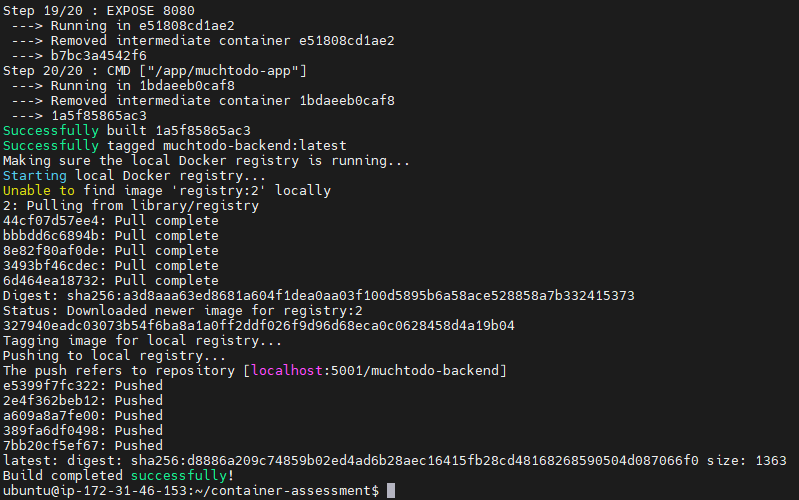
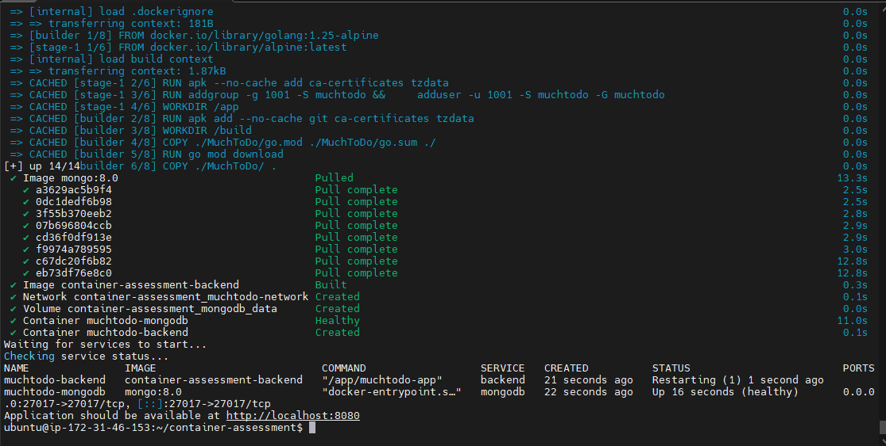
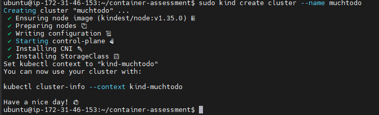
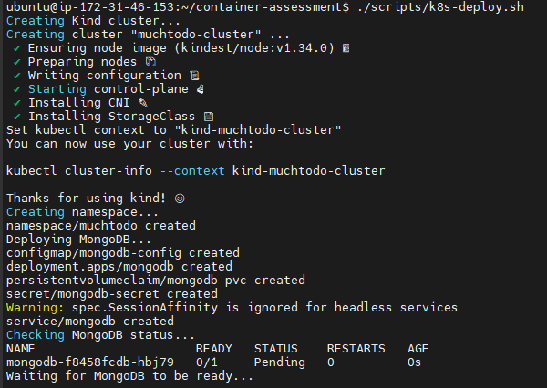
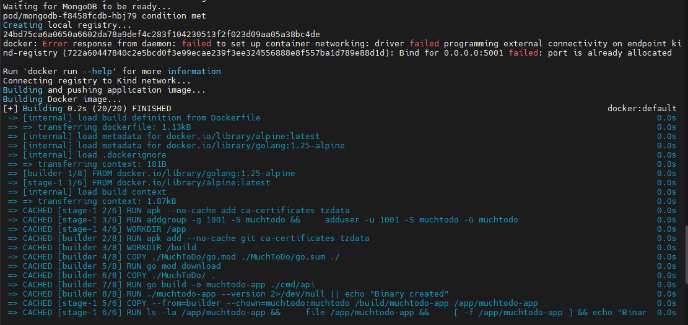
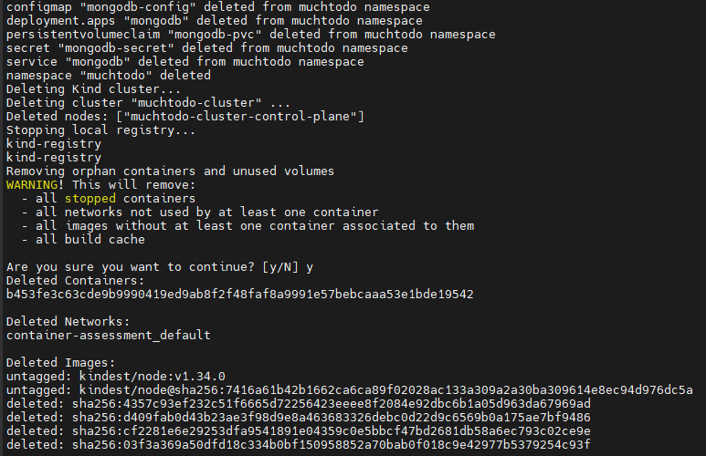
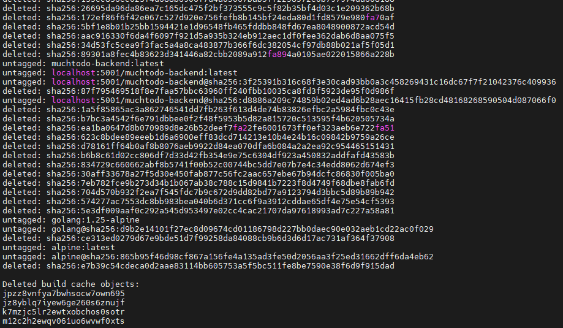

# MuchTodo Application Containerization
This project containerizes the MuchTodo Golang backend application and deploys it to Kubernetes.

## Prerequisites
- Docker
- Docker Compose
- Kubernetes CLI (kubectl)
- Kind (Kubernetes in Docker)
- Go 1.25+

---

## Quick Start
Clone the repository
```bash
git clone https://github.com/alaswadiyy/container-assessment.git
```

---

## Docker Development
1. copy `.env.example` to `.env`, then update the content accordingly
   ```bash
   cp MuchToDo/.env.example MuchToDo/.env
   ```
2. Run: `./scripts/docker-build.sh`
   
3. Run: `./scripts/docker-run.sh`
   
4. Access: http://localhost:8080/swagger/index.html
   

---

## Kubernetes Deployment
1. Ensure `step 1` from `Docker Developement` above has been done, if not repeat the step
2. Update the env path in `k8s-deploy.sh`
   ```bash
   kubectl create secret generic backend-env --from-file=.env=<path-to-your-env> \
      -n muchtodo --dry-run=client -o yaml | kubectl apply -f -
   ```
3. Run: `./scripts/k8s-deploy.sh`
   - Kind cluster creation
   
   - Kubernetes deployments running
   
   
   
4. Application accessible through a NodePort Service type to the host or Kubernetes ingress
   
5. Kubectl commands showing pod status, services, and ingress
   

For detailed script flow execution read [Documentation](./Documentation.md)

---

## Cleanup
1. Shut down the entire Docker Compose stack and deletes its data volumes:
   `sudo docker compose down -v`
2. Clean up unused Docker resources system-wide:
   `sudo docker system prune -af`
3. Kubernetes:
   `./scripts/k8s-cleanup.sh`
   
   

---

## Architecture
- Backend: Golang API on port 8080
- Database: MongoDB with persistence
- Kubernetes: Namespace-scoped deployment
- Ingress: Nginx ingress controller

---

## Health Checks
- Backend: http://localhost:8080/health
- MongoDB: Internal health probes

---

## Environment Variables
See `docker-compose.yml`, Kubernetes configs and secrets for environment configuration.
